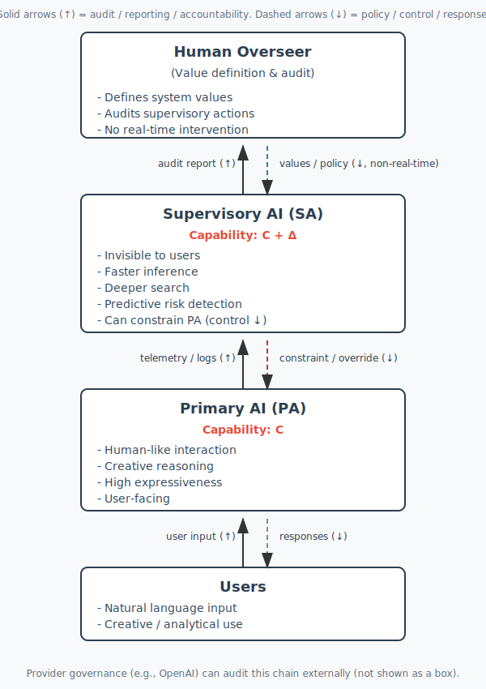

  ## TL;DR
A safety architecture where a Primary AI operates under a strictly superior Supervisory AI (C+Δ),
aiming for structural safety via asymmetric control rather than guardrail enumeration.

## Why it matters
- Reduces reliance on brittle rule lists
- Provides a clear audit surface for humans
- Enables scalable oversight as capabilities grow

## 1-minute diagram

# Hierarchical AI Safety Architecture
This repository contains a proposed hierarchical AI safety framework  
where a human-like Primary AI (PA) operates under an invisible,  
strictly superior Supervisory AI (SA).

---

## 📄 Full Paper
The full paper is available here:

➡️ [paper.md](paper.md)

---

## 📊 Figures
- [Architecture Diagram (SVG)](ai_safety_architecture.svg)
- [Architecture Diagram (PDF)](ai_safety_architecture.pdf)

---

## 🧠 Overview
This work proposes an asymmetric safety structure:
- Primary AI (capability C)
- Supervisory AI (capability C + Δ)
- Human oversight (policy & audit)

The system preserves expressiveness while ensuring strong safety  
through structural dominance rather than guardrail enumeration.

---

## 💬 Collaboration
I believe the future of AI safety lies in structural design.  
Feedback and academic collaboration are welcome in the **Discussions** section (to be enabled soon).

---

## ⚖️ License

## ⚖️ License

This repository is **licensed by component**:

- **Source code**: MIT License (see `LICENSE`)
- **Documentation, papers, and diagrams**: CC BY 4.0 (see `LICENSE-PAPER`)

Under **CC BY 4.0**, you are free to share and adapt the material for any purpose (including commercial), **as long as you provide attribution** and indicate changes.
